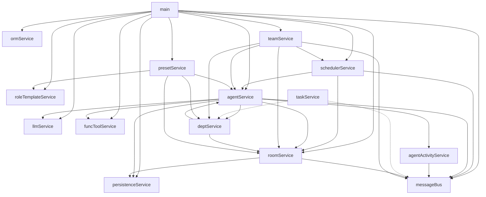

# Service 依赖关系图

## 核心原则

1.  **自治性**：Service 层负责维护各自领域的内存状态与业务逻辑。
2.  **持久化编排**：Service 层负责将业务领域对象转换为数据库对象（`GtXxx`），并调用 DAL 层进行持久化。DAL 层保持纯粹，不感知业务 DTO 或配置类。
3.  **单向依赖**：严格遵守从 Controller -> Service -> DAL -> Model 的调用链，禁止反向依赖。

| 模块 | 角色 | 依赖 |
|------|------|------|
| `main` | 程序入口，按序初始化所有服务，启动 Tornado 与全局调度器 | roleTemplateService / presetService / agentService / roomService / schedulerService / llmService / funcToolService / messageBus / persistenceService / ormService / teamService |
| `schedulerService` | 任务生命周期管理，监听轮次事件并激活 Agent 内部任务协程 | agentService / roomService / messageBus |
| `presetService` | 预置配置导入服务，负责初始化 RoleTemplate 与 Team 默认数据 | agentService / deptService / roleTemplateService / roomService |
| `roleTemplateService` | 角色模板基础服务 | 无 |
| `agentService` | **[自治核心]** 维护 Agent 实例及其任务队列，执行对话轮次与 Tool 调用，**负责 Agent 配置的持久化编排与对象转换** | llmService / roomService / funcToolService / persistenceService / messageBus / deptService / agentActivityService |
| `agentActivityService` | Agent 运行时详细活动轨迹（流式状态、工具调用等）的追踪与事件发布 | messageBus |
| `taskService` | Agent 协作任务与看板生命周期管理 | deptService / messageBus |
| `roomService` | 管理聊天室状态、成员名单、严格轮次推进逻辑，**负责房间配置与成员关系的持久化编排** | messageBus / persistenceService |
| `teamService` | Team/Room 配置管理与热更新，导入配置并**编排跨服务的运行态重载**（协调 Agent 与 Room 的更新） | deptService / agentService / roomService / schedulerService / messageBus |
| `deptService` | 部门树与成员归属管理，同步创建/更新部门房间并维护成员列表（V10） | roomService / agentService |
| `persistenceService` | 纯 DAL 门面，封装消息历史与房间运行时状态的读写；不依赖其他 service | 无 |
| `llmService` | 封装大模型 API 调用（OpenAI 兼容协议） | 无 |
| `funcToolService` | 提供工具注册、加载与执行环境 | 工具执行时动态依赖 agentService / deptService / teamService / taskService 等 |
| `messageBus` | 轻量级异步事件总线，负责组件间解耦通信；在事件循环中 `publish` 采用异步调度，避免慢订阅者阻塞发布链路 | 无 |
| `ormService` | SQLite 数据库连接管理，提供异步 ORM 初始化与 schema 迁移 | 无 |